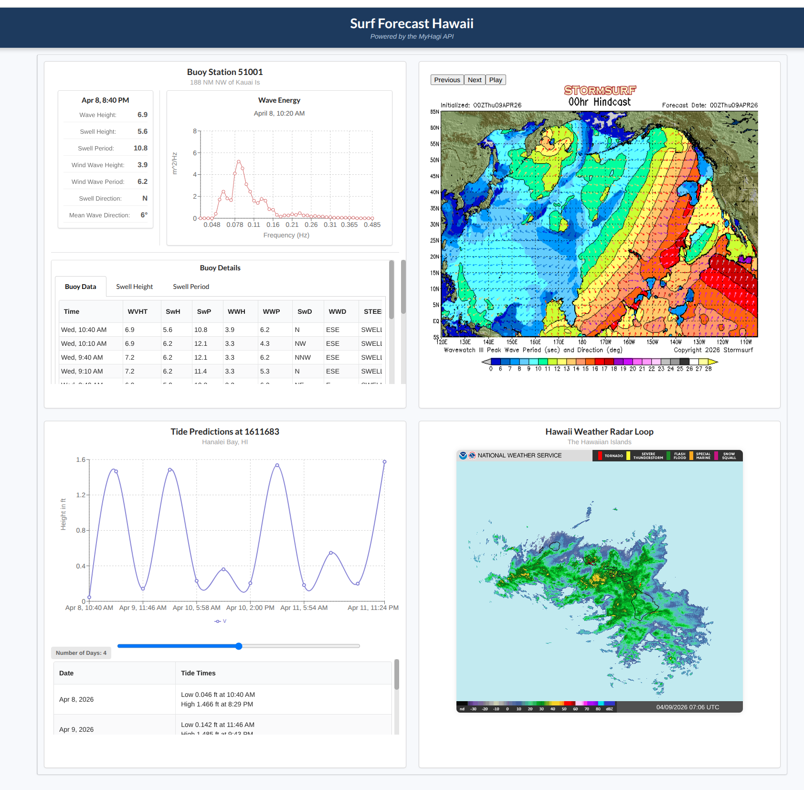

# Surf Forecast Hawaii  
## Powered by the MyHagi API  

🌊 **Live Site:** https://surfforecasthawaii.com  

A real-time surf and marine intelligence platform for Hawaii.

---

## Running Project

With two terminals
- Terminal 1
    ```
    cd backend 
    Python3 server.py
    ```
- Terminal 2
  ```
  cd client
  npm run start
  ```
---

## Overview

SurfForecastHawaii is a full-stack web application that aggregates and visualizes Hawaii surf conditions in a single unified interface.

The app combines multiple ocean data sources into one place so you don’t have to check multiple websites.

### Built With
- **Frontend:** React  
- **Backend:** Python (Flask)  
- **Deployment:** Ubuntu, Nginx, Gunicorn  

---

## Features

### 🌊 Buoy Station Reports
- Wave height, swell direction, and wind data  
- Real-time + historical readings  
- Directional indicators with visual cues  

---

### 📊 Wave Energy Spectrum
- Frequency-based energy breakdown  
- Visual representation of swell composition  
- Interactive tooltips with nested spectrum charts  

---

### 🌊 Tides & Marine Forecast
- Tide prediction charts  
- NOAA marine forecast integration  
- Time-based surf condition tracking  

---

### 🛰️ Satellite & Radar
- NOAA geocolor satellite imagery  
- Hawaii radar loop visualization  
- Stormsurf wave model overlays  

---

## Screenshots

### 🌊 Main Dashboard

<p align="center">
  
</p>

- Buoy station data with wave height, swell, and wind  
- Wave energy frequency spectrum visualization  
- Tide predictions with interactive chart  
- Detailed buoy tables with historical data  

---

### 🛰️ Forecast & Satellite Data

<p align="center">
  
</p>

- Stormsurf wave model visualization  
- NOAA satellite geocolor imagery  
- Marine forecast text data  
- Time-series wave trend charts  

---

### 🧠 Multi-View Dashboard (All Data At Once)

<p align="center">
  
</p>

- Combine buoy data, energy charts, and forecasts  
- Compare multiple signals simultaneously  
- Designed for fast, real-world decision-making  
