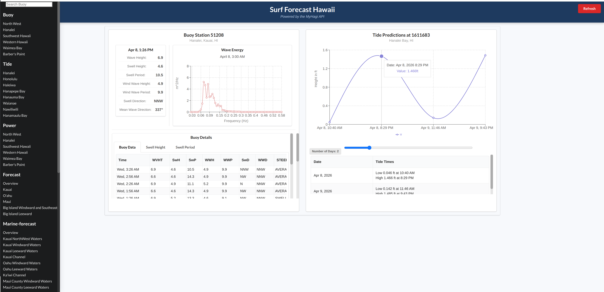

# Surf Forecast Hawaii
## Powered by the MyHagi API
A surf report web application
surfforecasthawaii.com

SurfForecastHawaii is a full-stack web application that aggregates and presents Hawaii surf and marine data through interactive charts, tables, and station-based reports. The project uses a React frontend and Python backend, and is deployed on Ubuntu with Nginx and Gunicorn.

## Running Project

With two terminals
- Terminal 1
    ```
    cd backend 
    Python3 server.py
    ```
- Terminal 2
  ```
  cd client
  npm run start
  ```

## Screenshots

### Main Dashboard



- Buoy station data with wave height, swell, and wind
- Wave energy frequency spectrum visualization
- Tide predictions with interactive chart
- Detailed buoy tables with historical data

---

### Forecast & Satellite Data


- Stormsurf wave model visualization
- NOAA satellite geocolor imagery
- Marine forecast text data
- Time-series wave trend charts
